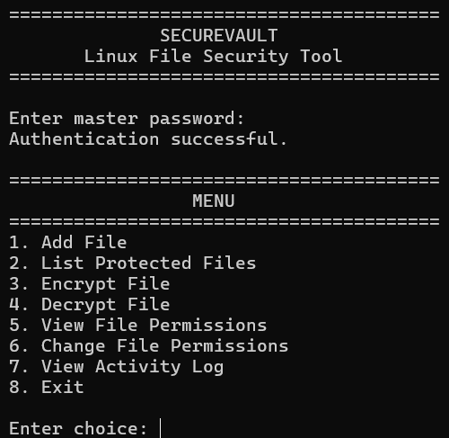
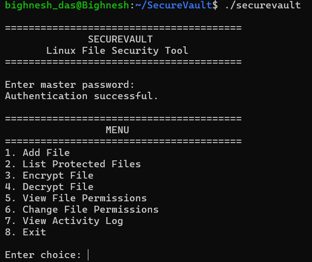
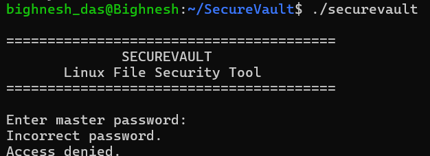
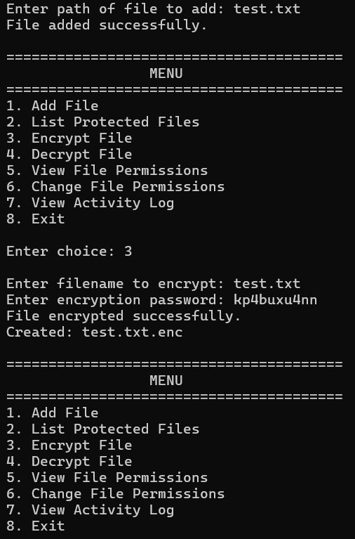
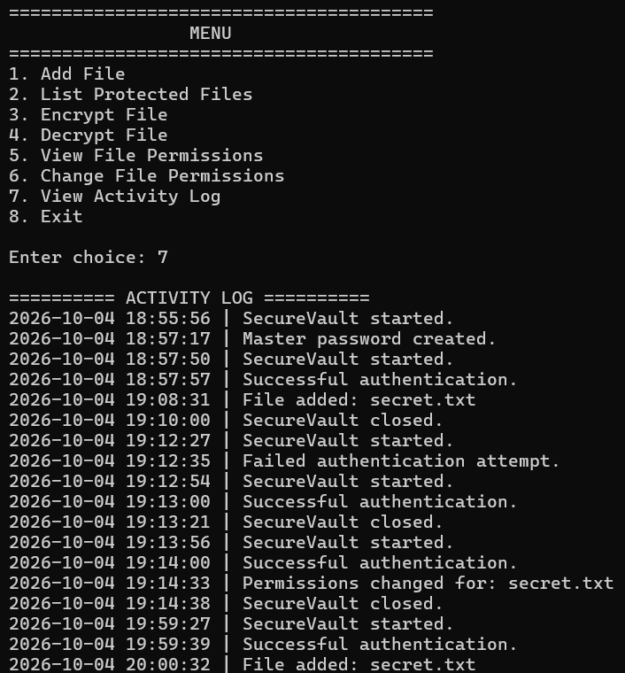

# SecureVault – Linux File & Password Security Tool

A Linux-based C++17 security application for protecting files through password authentication, AES-256-GCM encryption, Linux file permissions, and activity logging.

---

## Overview

**SecureVault** is a command-line security tool designed to provide a simple mechanism for protecting sensitive files on Linux systems.

The application combines:

- Password-based authentication
- AES-256-GCM file encryption
- PBKDF2-HMAC-SHA256 key derivation
- Linux file permission management
- Activity logging
- Secure password input
- Local protected file storage

The project was developed as part of a Linux and system programming training project.

---

## Problem Statement

Sensitive files stored on a local system can be exposed through unauthorized access, weak file permissions, or lack of encryption.

SecureVault addresses this problem by providing a lightweight command-line application that allows users to:

1. Authenticate using a master password.
2. Add files to a protected vault.
3. Encrypt sensitive files.
4. Decrypt files when required.
5. View and modify Linux file permissions.
6. Monitor important activities through application logs.

---

## Objectives

- Develop a Linux-based security application using C++17.
- Implement password-based authentication.
- Protect files using AES-256-GCM encryption.
- Derive encryption keys securely using PBKDF2-HMAC-SHA256.
- Demonstrate Linux file permission management using `stat()` and `chmod()`.
- Implement activity logging.
- Apply modular software design principles.
- Use Git and GitHub for version control and project management.

---

## Key Features

| Feature | Description |
|---|---|
| Master Password Authentication | Protects access to the SecureVault application |
| Hidden Password Input | Prevents passwords from being displayed in the terminal |
| File Management | Adds and lists files stored in the protected vault |
| AES-256-GCM Encryption | Provides authenticated file encryption |
| PBKDF2 Key Derivation | Derives encryption keys from user passwords |
| Linux Permissions | Views and modifies file permissions |
| Activity Logging | Records important application operations |
| Command-Line Interface | Provides a simple Linux terminal-based interface |

---

## Application Preview

### SecureVault Main Menu



### Authentication



### Unsuccessfull authentication



### File Encryption



### Activity Log



---

# System Architecture

```text
                         ┌──────────────────────┐
                         │    SecureVault CLI   │
                         └──────────┬───────────┘
                                    │
              ┌─────────────────────┼─────────────────────┐
              │                     │                     │
              ▼                     ▼                     ▼
      ┌───────────────┐     ┌───────────────┐     ┌───────────────┐
      │ Authentication│     │ File Manager  │     │  Encryption   │
      └───────┬───────┘     └───────┬───────┘     └───────┬───────┘
              │                     │                     │
              ▼                     ▼                     ▼
       Password Hash            Vault Files          AES-256-GCM
                                    │                     │
                                    └──────────┬──────────┘
                                               │
                         ┌─────────────────────┴─────────────────────┐
                         │                                           │
                         ▼                                           ▼
                ┌─────────────────┐                         ┌─────────────────┐
                │   Permissions   │                         │     Logger      │
                │ stat() / chmod()│                         │ Activity Log    │
                └─────────────────┘                         └─────────────────┘
```

---

# Project Structure

```text
SecureVault/
├── Makefile
├── README.md
├── .gitignore
│
├── include/
│   ├── authentication.h
│   ├── encryption.h
│   ├── file_manager.h
│   ├── logger.h
│   └── permissions.h
│
├── src/
│   ├── authentication.cpp
│   ├── encryption.cpp
│   ├── file_manager.cpp
│   ├── logger.cpp
│   ├── main.cpp
│   └── permissions.cpp
│
├── images/
│   ├── menu.png
│   ├── authentication.png
│   ├── encryption.png
│   ├── permissions.png
│   └── activity-log.png
│
├── logs/
├── tests/
└── vault/
```

> Runtime files inside `vault/`, `logs/`, and generated binaries are excluded from version control using `.gitignore`.

---

# Technology Stack

| Component | Technology |
|---|---|
| Programming Language | C++17 |
| Operating System | Linux / WSL2 |
| Cryptography Library | OpenSSL |
| Encryption | AES-256-GCM |
| Key Derivation | PBKDF2-HMAC-SHA256 |
| File Management | C++17 `std::filesystem` |
| File Permissions | Linux `stat()` / `chmod()` |
| Build System | GNU Make |
| Version Control | Git / GitHub |

---

# Application Modules

## 1. Authentication

Responsible for:

- Creating the master password
- Authenticating users
- Storing the password hash
- Hidden password input using Linux terminal controls

The master password is not stored as plaintext.

---

## 2. File Manager

Responsible for:

- Adding files to the vault
- Listing protected files
- Checking whether files exist
- Copying files into the `vault/` directory

The implementation uses C++17 `std::filesystem`.

---

## 3. Encryption

Responsible for:

- Encrypting files
- Decrypting files
- Deriving encryption keys
- Generating cryptographically secure random salt and IV values
- Verifying the authentication tag during decryption

Encryption is implemented using OpenSSL's EVP API.

---

## 4. Permissions

Responsible for:

- Viewing Linux file permissions
- Changing file permissions
- Demonstrating Linux permission modes

Supported examples include:

| Permission | Meaning |
|---|---|
| `600` | Owner can read and write |
| `644` | Owner can read/write, others can read |
| `700` | Owner has full access |

---

## 5. Logger

The logger records important application events with timestamps.

Examples include:

- Successful login
- Failed login
- File added
- File encrypted
- File decrypted
- Failed decryption attempt
- Permission changes

---

# Encryption Design

SecureVault uses **AES-256-GCM**, an authenticated encryption algorithm.

The encryption key is derived from the user-provided password using:

**PBKDF2-HMAC-SHA256**

### Encryption Parameters

| Parameter | Value |
|---|---|
| Encryption Algorithm | AES-256-GCM |
| Key Size | 256 bits |
| Salt Size | 16 bytes |
| IV Size | 12 bytes |
| Authentication Tag | 16 bytes |
| Key Derivation | PBKDF2-HMAC-SHA256 |
| PBKDF2 Iterations | 100,000 |

---

# Encryption Workflow

```text
User Password
      │
      ▼
Generate Random Salt
      │
      ▼
PBKDF2-HMAC-SHA256
      │
      ▼
256-bit Encryption Key
      │
      ▼
Generate Random IV
      │
      ▼
AES-256-GCM Encryption
      │
      ▼
Ciphertext + Authentication Tag
      │
      ▼
Encrypted File (.enc)
```

---

# Encrypted File Format

Encrypted files are stored using the following structure:

```text
┌──────────────┬────────────┬────────────────┬────────────────────┐
│     SALT     │     IV     │   CIPHERTEXT   │  AUTHENTICATION    │
│   16 bytes   │  12 bytes  │   Variable     │     TAG - 16 bytes │
└──────────────┴────────────┴────────────────┴────────────────────┘
```

The encrypted file therefore contains:

```text
[SALT][IV][CIPHERTEXT][TAG]
```

During decryption, the authentication tag is verified before the decrypted plaintext is written to the output file.

---

# Linux File Permissions

SecureVault uses Linux system-level permission functions:

```cpp
stat()
chmod()
```

The application displays permissions for:

- Owner
- Group
- Others

Example:

```text
Owner: RW-
Group: R--
Others: ---
```

Permissions can also be changed using modes such as:

```text
600
644
700
```

---

# Activity Logging

SecureVault maintains an activity log containing timestamps and application events.

Example:

```text
[2026-10-05 12:10:15] User login successful
[2026-10-05 12:11:02] File added: document.txt
[2026-10-05 12:11:30] File encrypted: document.txt
[2026-10-05 12:12:05] File decrypted: document.txt.enc
[2026-10-05 12:12:30] Permissions changed for: document.txt
```

---

# Application Menu

```text
========== SecureVault ==========

1. Add File
2. List Protected Files
3. Encrypt File
4. Decrypt File
5. View File Permissions
6. Change File Permissions
7. View Activity Log
8. Exit
```

---

# Installation & Setup

## Prerequisites

The following are required:

- Linux or WSL2
- GNU C++ compiler
- C++17 support
- OpenSSL development libraries
- GNU Make

On Ubuntu:

```bash
sudo apt update
sudo apt install g++ make libssl-dev
```

---

# Build

Clone the repository:

```bash
git clone https://github.com/YOUR_USERNAME/SecureVault.git
cd SecureVault
```

Build the project:

```bash
make
```

---

# Run

Run the application using:

```bash
./securevault
```

Or use:

```bash
make run
```

---

# Typical Workflow

```text
Start SecureVault
       │
       ▼
Create / Enter Master Password
       │
       ▼
Authenticate
       │
       ▼
Add File to Vault
       │
       ▼
Encrypt File
       │
       ▼
Protected File Stored
       │
       ├───────────────┐
       │               │
       ▼               ▼
 View Permissions   View Activity Log
       │
       ▼
   Decrypt File
       │
       ▼
 Original File Recovered
```

---

# Testing

| Test Case | Expected Result | Result |
|---|---|---|
| Create master password | Password is stored as a hash | Pass |
| Correct login | User gains access | Pass |
| Incorrect login | Access is denied | Pass |
| Add file | File is copied into vault | Pass |
| List protected files | Vault files are displayed | Pass |
| Encrypt file | Encrypted `.enc` file is created | Pass |
| Decrypt with correct password | Original file is recovered | Pass |
| Decrypt with incorrect password | Decryption fails | Pass |
| View permissions | Current permissions are displayed | Pass |
| Change permissions | File permissions are updated | Pass |
| View activity log | Application activities are displayed | Pass |

---

# Development Stages

| Stage | Focus | Key Deliverables |
|---|---|---|
| Stage 1 | Project Introduction | Problem, objectives, scope, expected outcome |
| Stage 2 | Requirements & Planning | Functional/non-functional requirements and development plan |
| Stage 3 | System Design | Architecture, components, data structures and UML |
| Stage 4 | Initial Implementation | Core modules and working prototype |
| Stage 5 | Testing & Integration | Testing, debugging and improvements |
| Stage 6 | Final Implementation | Final system, documentation and presentation |

---

# Git & Version Control

The project uses Git for version control.

Typical development workflow:

```bash
git add .
git commit -m "Describe your changes"
git push
```

The repository maintains a history of project development and allows previous versions of the project to be inspected or restored.

---

# Limitations

SecureVault is an academic/training project and is **not intended for production use**.

Current limitations include:

- Master password storage currently uses a SHA-256 hash and is not a production-grade password hashing solution.
- The application is command-line based.
- Files are loaded into memory during encryption/decryption.
- The vault is local to the system.
- There is no multi-user access-control system.
- There is no cloud synchronization.
- The project does not currently implement a Linux kernel device driver.

---

# Future Improvements

Possible future enhancements include:

- Use Argon2, bcrypt, or scrypt for master-password hashing.
- Implement secure memory handling for sensitive password material.
- Add file integrity verification.
- Support encryption of large files using streaming.
- Add a graphical user interface.
- Add multi-user authentication and role-based access control.
- Add secure backup and recovery mechanisms.
- Add automated unit and integration tests.
- Add optional secure cloud backup.
- Improve audit logging and security monitoring.

---

# Learning Outcomes

Through this project, the following concepts were applied:

- Linux command-line development
- C++17 programming
- Object-oriented programming
- Linux file systems
- File permissions
- `stat()` and `chmod()`
- Cryptography concepts
- AES-GCM encryption
- PBKDF2 key derivation
- OpenSSL EVP API
- Password authentication
- Activity logging
- Makefiles
- Git and GitHub
- Software architecture
- System design
- Testing and debugging

---

# Conclusion

SecureVault demonstrates how Linux system programming, C++ development, cryptographic libraries, file permissions, authentication, and version control can be combined to create a practical file-security application.

The project provides a functional foundation for secure local file management while demonstrating important concepts in Linux security and systems programming.

---

## Author

**Bighnesh Das**

C++17 | Linux | OpenSSL | Git | System Programming